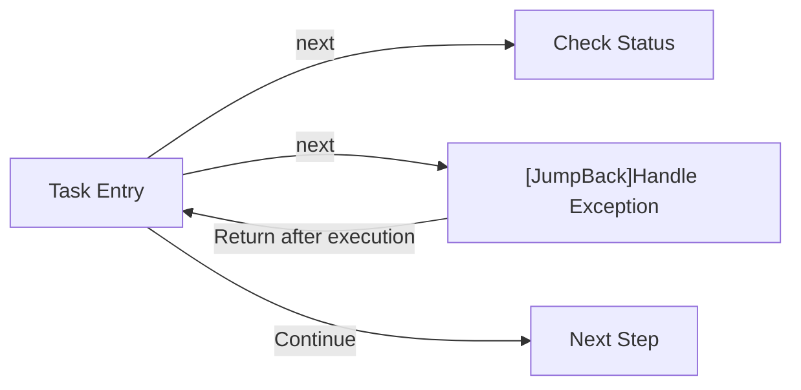

# Pipeline Writing Guide

## What is Pipeline?

Pipeline is the core concept of MaaFramework, describing the execution flow of automated tasks in JSON format. Each Pipeline consists of multiple nodes (Nodes), each defining:

- **Recognition algorithm** (recognition): How to identify targets on the screen
- **Execution action** (action): The operation to perform after successful recognition
- **Successor nodes** (next): The next step to execute after completing the current node

## Protocol Version

M9A is based on **MaaFramework v5.1+** and uses the **Pipeline v2** protocol:

```json
{
    "NodeName": {
        "recognition": {
            "type": "OCR",
            "param": {
                "roi": [100, 100, 200, 50],
                "expected": ["Confirm"]
            }
        },
        "action": {
            "type": "Click"
        },
        "next": ["NextNode"]
    }
}
```

:::tip
The v2 protocol unifies recognition and action-related parameters into `type` and `param` fields for a clearer structure.
For detailed protocol specifications, refer to [MaaFramework Pipeline Protocol](https://maafw.xyz/docs/3.1-PipelineProtocol).
:::

## Basic Structure and Execution Flow

### Node Execution Order

Pipeline executes according to the following flow:

1. Start from the entry node
2. Check nodes in the `next` list sequentially
3. Execute the action of the first matching node
4. Use that node as the new current node, repeat step 2
5. Continue until `next` is empty or timeout occurs, ending the task

### Node Connection Mechanism

Nodes are connected through the `next` field, supporting node attribute syntax:

```json
{
    "StartTask": {
        "next": [
            "CheckStatus",           // Regular node
            "[JumpBack]HandleError"  // Node with JumpBack attribute
        ]
    }
}
```

**JumpBack Mechanism** (v5.1+ new feature, replaces deprecated `interrupt` and `is_sub`):

- Nodes marked with `[JumpBack]` return to the parent node after execution
- Suitable for exception handling, popup closing, and similar scenarios

Example flow:



## M9A Writing Standards

### File and Resource Naming

To ensure resource consistency and aesthetics, follow these rules:

**Pipeline JSON Files**:

- Generally use **snake_case**: `all_in.json`, `combat_stage.json`
- Event-related files use **PascalCase**: `LondonDawning.json`

**Image Files**:

- Use **PascalCase**: `OpenReplaysTimes.png`, `StartButton.png`
- Organize by function into corresponding folders under `image/`

**Image Folder Structure**:

- Each pipeline JSON corresponds to one image folder
- Event images are unified in `image/Combat/Activity/`

### Node Naming Standards

Review existing files and maintain consistent style.

### Writing Best Practices

:::tip Node Connection Principles

- **`next` field**: Place exit nodes of the current node, marking completion of staged tasks
- **`[JumpBack]` nodes**: Used for exception handling, popup closing, etc., returning to parent after execution
- **Reduce coupling**: Design highly reusable nodes (like `BackButton`) as `[JumpBack]` nodes
- **Self-loop**: In some cases, add the node to its own `next` (handling cases where operations don't take effect)
- **Page transitions**: Add `post_wait_freezes` field, set `time` and `target` to ensure interface stability
- **Swipe operations**: Add click operation after swiping to ensure screen stability

:::

**JumpBack Usage Example**:

```json
{
    "ActivityMain": {
        "recognition": {
            "type": "TemplateMatch",
            "param": { "template": "ActivityMainPage.png" }
        },
        "next": [
            "StartBattle",
            "[JumpBack]ClosePopup",
            "[JumpBack]BackToMain"
        ]
    },
    "ClosePopup": {
        "doc": "Close possible popups",
        "recognition": {
            "type": "TemplateMatch",
            "param": { "template": "CloseButton.png" }
        },
        "action": {
            "type": "Click"
        }
    }
}
```

:::warning Cautions

- **Use `inverse` cautiously**: May lead to unpredictable tasks, if necessary use with `post_wait_freezes` to ensure state
- **Avoid unconditional matching**: `DirectHit` type nodes have no judgment conditions, may cause unexpected loops
- **Priority order**: Nodes in `next` should be arranged from high to low priority, avoid priority inversion
- **Match frequency optimization**: Nodes with same priority can be sorted by match frequency to improve hit efficiency

:::

**Priority Sorting Example**:

```plaintext
Assume the following scenario:
- Node B: Detect small popup (high priority, low frequency)
- Node A: Detect main interface (low priority, high frequency)

If A can still match when popup appears, must use:
  "next": ["B", "A"]  // ✓ B has higher priority, check first
Instead of:
  "next": ["A", "B"]  // ✗ Will fail to handle B and get stuck on A
```

### Comment Standards

In `pipeline.json` files, there are two types of comment attribute fields:

1. `.*_doc$|^doc$`: Strings ending with `_doc` or exactly `doc`, used for descriptions
2. `.*_code$|^code$`: Strings ending with `_code` or exactly `code`, used for required field placeholders

**Example** (Pipeline v2 format):

```json
{
    "EnterTheActivityMain": {
        "doc": "Enter current event main interface",
        "template_code": "Modify template in interface.json",
        "recognition": {
            "type": "TemplateMatch",
            "param": {
                "roi": [885, 123, 340, 183]
            }
        },
        "action": {
            "type": "Click"
        },
        "post_wait_freezes": {
            "time": 500,
            "target": [0, 179, 190, 541]
        }
    }
}
```

**Explanation**:

- `doc`: Functional description of current node
- `template_code`: Required field placeholder, prompts to configure `template` in `interface.json`

:::tip Why do we need _code fields?

When `recognition.type` is `TemplateMatch`, the `template` field is required. However, in actual projects, we typically configure `template` uniformly in `interface.json` rather than hardcoding it in each pipeline JSON. Therefore, `template_code` is used as a placeholder to remind developers to configure it in the correct location.

:::

## Practical Examples

The following are real examples extracted from M9A project's `all_in.json`, demonstrating the practical application of Pipeline v2 protocol:

### Example 1: Battle Entry Detection

```json
{
    "CombatEntering": {
        "recognition": {
            "type": "TemplateMatch",
            "param": {
                "roi": [0, 5, 90, 70]
            }
        },
        "action": {
            "type": "DoNothing"
        },
        "next": [
            "TargetCountProgress",
            "[JumpBack]CombatEntering"
        ]
    },
    "TargetCountProgress": {
        "recognition": {
            "type": "TemplateMatch",
            "param": {
                "roi": [1118, 34, 140, 37]
            }
        },
        "action": {
            "type": "DoNothing"
        },
        "next": ["StageChoose"]
    }
}
```

**Analysis**:

- `CombatEntering` detects battle entry interface
- Uses `[JumpBack]CombatEntering` to implement self-loop, ensuring interface loading completion
- `TargetCountProgress` serves as progress marker node, proceeding to stage selection after completion

### Example 2: Page Transition and Waiting

```json
{
    "OpenReplaysTimes": {
        "recognition": {
            "type": "TemplateMatch",
            "param": {
                "roi": [855, 615, 80, 45]
            }
        },
        "action": {
            "type": "Click"
        },
        "post_wait_freezes": {
            "time": 800,
            "target": [563, 307, 155, 92]
        },
        "next": ["ChangeReplaysTimes"]
    }
}
```

**Analysis**:

- Clicks to open replay times settings
- Uses `post_wait_freezes` to wait for popup stabilization (800ms)
- `target` specifies popup area, ensuring popup is fully displayed before continuing

### Example 3: JumpBack Exception Handling

```json
{
    "StageChoose": {
        "recognition": {
            "type": "TemplateMatch",
            "param": {
                "roi": [0, 59, 1280, 661]
            }
        },
        "action": {
            "type": "Click",
            "param": {
                "target": true
            }
        },
        "next": [
            "TargetCountProgress",
            "[JumpBack]StageChoose",
            "[JumpBack]BackButton"
        ]
    },
    "BackButton": {
        "recognition": {
            "type": "TemplateMatch",
            "param": {
                "roi": [23, 14, 60, 50]
            }
        },
        "action": {
            "type": "Click"
        }
    }
}
```

**Analysis**:

- `StageChoose` performs stage selection operation
- `[JumpBack]StageChoose` handles cases where click didn't take effect
- `[JumpBack]BackButton` handles accidentally entering other interfaces (returns and re-executes `StageChoose`)
- `BackButton` doesn't set `next`, serves as pure utility node for reuse across multiple locations

## Reference Resources

- [MaaFramework Task Pipeline Protocol](https://maafw.xyz/docs/3.1-PipelineProtocol)
- [MaaFramework Project Interface Protocol](https://maafw.xyz/docs/3.3-ProjectInterfaceV2)
