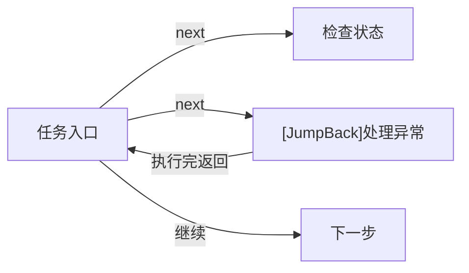

# Pipeline 编写指南

## 什么是 Pipeline？

Pipeline（任务流水线）是 MaaFramework 的核心概念，通过 JSON 格式描述自动化任务的执行流程。每个 Pipeline 由多个节点（Node）组成，每个节点定义了：

- **识别算法**（recognition）：如何识别屏幕上的目标
- **执行动作**（action）：识别成功后要执行的操作
- **后继节点**（next）：完成当前节点后要执行的下一步

## 协议版本

M9A 基于 **MaaFramework v5.1+**，使用 **Pipeline v2** 协议：

```json
{
    "NodeName": {
        "recognition": {
            "type": "OCR",
            "param": {
                "roi": [100, 100, 200, 50],
                "expected": ["确认"]
            }
        },
        "action": {
            "type": "Click"
        },
        "next": ["NextNode"]
    }
}
```

:::tip
v2 协议将识别和动作相关参数统一放入 `type` 和 `param` 字段中，结构更清晰。
详细协议说明请参考 [MaaFramework Pipeline 协议](https://maafw.xyz/docs/3.1-PipelineProtocol)。
:::

## 基本结构与执行流程

### 节点执行顺序

Pipeline 按以下流程执行：

1. 从入口节点开始
2. 依次检测 `next` 列表中的节点
3. 找到第一个匹配的节点后，执行其动作
4. 将该节点作为新的当前节点，重复步骤 2
5. 直到 `next` 为空或超时，任务结束

### 节点连接机制

节点通过 `next` 字段连接，支持节点属性语法：

```json
{
    "StartTask": {
        "next": [
            "CheckStatus",           // 普通节点
            "[JumpBack]HandleError"  // 带 JumpBack 属性的节点
        ]
    }
}
```

**JumpBack 机制**（v5.1+ 新增，替代已废弃的 `interrupt` 和 `is_sub`）：

- 标记为 `[JumpBack]` 的节点执行完成后，会返回到父节点继续执行
- 适用于异常处理、弹窗关闭等场景

示例流程：



## M9A 编写规范

### 文件与资源命名

为保证资源的美观一致，请遵循以下规则：

**Pipeline JSON 文件**：

- 一般采用**蛇形命名法**：`all_in.json`、`combat_stage.json`
- 活动相关采用**大驼峰命名法**：`LondonDawning.json`

**图片文件**：

- 采用**大驼峰命名法**：`OpenReplaysTimes.png`、`StartButton.png`
- 按功能分类放入 `image/` 下的对应文件夹

**Image 文件夹结构**：

- 每个 pipeline JSON 对应一个 image 文件夹
- 活动图片统一放在 `image/Combat/Activity/` 下

### 节点命名规范

查看现有的文件，保持风格一致。

### 编写最佳实践

:::tip 节点连接原则

- **`next` 字段**：放置当前节点的出口节点，表示完成阶段性任务
- **`[JumpBack]` 节点**：用于异常处理、弹窗关闭等场景，执行后返回父节点
- **降低耦合**：将复用性高的节点（如 `BackButton`）设计为 `[JumpBack]` 节点
- **自循环**：部分情况下可将节点加入自身 `next`（应对操作未生效的情况）
- **页面切换**：加入 `post_wait_freezes` 字段，设置 `time` 和 `target` 确保界面稳定
- **滑动操作**：滑动后添加点击操作，确保画面稳定

:::

**JumpBack 使用示例**：

```json
{
    "ActivityMain": {
        "recognition": {
            "type": "TemplateMatch",
            "param": {
                "template": "ActivityMainPage.png"
            }
        },
        "next": [
            "StartBattle",
            "[JumpBack]ClosePopup",
            "[JumpBack]BackToMain"
        ]
    },
    "ClosePopup": {
        "doc": "关闭可能出现的弹窗",
        "recognition": {
            "type": "TemplateMatch",
            "param": {
                "template": "CloseButton.png"
            }
        },
        "action": {
            "type": "Click"
        }
    }
}
```

:::warning 注意事项

- **慎用 `inverse`**：可能导致任务不可预测，如必须使用需配合 `post_wait_freezes` 确保状态
- **避免无条件匹配**：`DirectHit` 类型节点无任何判断条件，可能导致非预期循环
- **优先级顺序**：`next` 中节点按优先级从高到低排列，避免优先级倒挂
- **匹配频率优化**：同优先级节点可按匹配频率排序，提高命中效率

:::

**优先级排序示例**：

```plaintext
假设有以下场景：
- Node B：判断小弹窗（优先级高，但频率低）
- Node A：判断主界面（优先级低，但频率高）

如果弹窗出现时依旧能匹配到 A，则必须：
  "next": ["B", "A"]  // ✓ B 优先级高，先判断
而不是：
  "next": ["A", "B"]  // ✗ 会导致无法处理 B 而卡死
```

### 注释规范

`pipeline.json` 文件中，注释共两种属性字段：

1. `.*_doc$|^doc$`：以 `_doc` 结尾或正好是 `doc` 的字符串，用于说明
2. `.*_code$|^code$`：以 `_code` 结尾或正好是 `code` 的字符串，用于必填字段占位

**示例**（Pipeline v2 格式）：

```json
{
    "EnterTheActivityMain": {
        "doc": "进入当期活动主界面",
        "template_code": "在 interface.json 中修改 template",
        "recognition": {
            "type": "TemplateMatch",
            "param": {
                "roi": [885, 123, 340, 183]
            }
        },
        "action": {
            "type": "Click"
        },
        "post_wait_freezes": {
            "time": 500,
            "target": [0, 179, 190, 541]
        }
    }
}
```

**说明**：

- `doc`：当前节点的功能说明
- `template_code`：必填字段占位符，提示在 `interface.json` 中配置 `template`

:::tip 为什么需要 _code 字段？

当 `recognition.type` 为 `TemplateMatch` 时，`template` 字段为必填项。但在实际项目中，我们通常在 `interface.json` 中统一配置 `template`，而不是在每个 pipeline JSON 中硬编码。因此使用 `template_code` 占位，提示开发者在正确位置配置。

:::

## 实战示例

以下是从 M9A 项目 `all_in.json` 中提取的真实示例，展示 Pipeline v2 协议的实际应用：

### 示例 1：战斗入口检测

```json
{
    "CombatEntering": {
        "recognition": {
            "type": "TemplateMatch",
            "param": {
                "roi": [0, 5, 90, 70]
            }
        },
        "action": {
            "type": "DoNothing"
        },
        "next": [
            "TargetCountProgress",
            "[JumpBack]CombatEntering"
        ]
    },
    "TargetCountProgress": {
        "recognition": {
            "type": "TemplateMatch",
            "param": {
                "roi": [1118, 34, 140, 37]
            }
        },
        "action": {
            "type": "DoNothing"
        },
        "next": ["StageChoose"]
    }
}
```

**分析**：

- `CombatEntering` 检测战斗入口界面
- 使用 `[JumpBack]CombatEntering` 实现自循环，确保界面加载完成
- `TargetCountProgress` 作为进度标志节点，完成后进入关卡选择

### 示例 2：页面切换与等待

```json
{
    "OpenReplaysTimes": {
        "recognition": {
            "type": "TemplateMatch",
            "param": {
                "roi": [855, 615, 80, 45]
            }
        },
        "action": {
            "type": "Click"
        },
        "post_wait_freezes": {
            "time": 800,
            "target": [563, 307, 155, 92]
        },
        "next": ["ChangeReplaysTimes"]
    }
}
```

**分析**：

- 点击打开重刷次数设置
- 使用 `post_wait_freezes` 等待弹窗稳定（800ms）
- `target` 指定弹窗区域，确保弹窗完全显示后再继续

### 示例 3：JumpBack 异常处理

```json
{
    "StageChoose": {
        "recognition": {
            "type": "TemplateMatch",
            "param": {
                "roi": [0, 59, 1280, 661]
            }
        },
        "action": {
            "type": "Click",
            "param": {
                "target": true
            }
        },
        "next": [
            "TargetCountProgress",
            "[JumpBack]StageChoose",
            "[JumpBack]BackButton"
        ]
    },
    "BackButton": {
        "recognition": {
            "type": "TemplateMatch",
            "param": {
                "roi": [23, 14, 60, 50]
            }
        },
        "action": {
            "type": "Click"
        }
    }
}
```

**分析**：

- `StageChoose` 执行关卡选择操作
- `[JumpBack]StageChoose` 处理点击未生效的情况
- `[JumpBack]BackButton` 处理意外进入其他界面的情况（返回后重新执行 `StageChoose`）
- `BackButton` 不设置 `next`，作为纯工具节点供多处复用

## 参考资源

- [MaaFramework 任务流水线协议](https://maafw.xyz/docs/3.1-PipelineProtocol)
- [MaaFramework 项目接口协议](https://maafw.xyz/docs/3.3-ProjectInterfaceV2)
